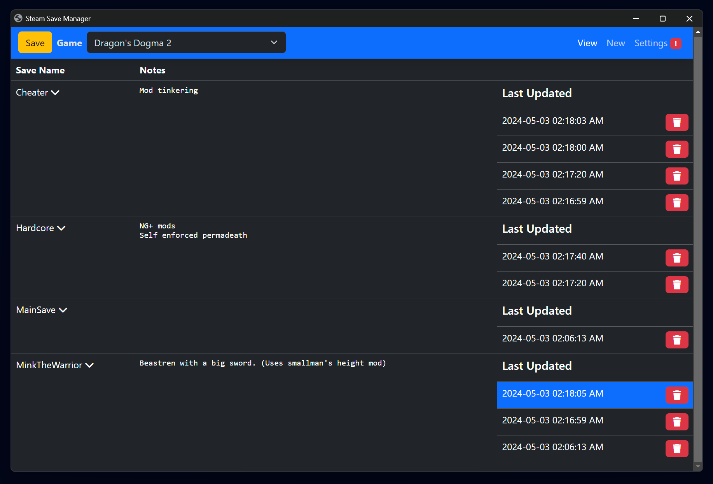

# Steam Save Manager
A Python program for managing multiple Steam save files.

# Features
- Start a new save whenever you want without losing your progress on other saves
- Create saves and switch between them
- Unlimited number of save files
- Backup individual saves
- Automatic updating

# Planned Features
- Automatic backups while application is running (on interval)
- Import saves

# Disclaimer
While I have tested in a controlled environment, I haven't given this enough time to guarantee your save files. Multiple checks have been put in place to prevent data loss, but there is always a possibility I missed something. As I can test further, i'll update this.

**Please take care to back up your saves if you have concerns.**

# Installation
On the right side of Github, navigate to `Releases` and download the latest.

Note: The same concepts applied in llamaiscool's version was applied here. The below may still be relevant, but has not been tested.

**THIS PROGRAM WILL NOT WORK IF YOU DO NOT DISABLE STEAM CLOUD FOR YOUR GAME**

Before installing, I recommend backing up your save file manually just in case something goes wrong.

# How to Use

Extract the zip file into a folder somewhere safe.

Launch the `Steam Save Manager.exe`  application

The application will attempt to automatically locate your save folder. In the event it is unable, you will be prompted to do so yourself. 

**If you are asked to locate the folders yourself:** This file is usually found at `Program Files (x86)/Steam/userdata/{your steam account id}/{game id}`. For example, the game id for Dragon's Dogma 2 is 2054970, so the folder you want is `C:/Program Files (x86)/Steam/userdata/{your steam account id}/2054970`.

All of your currently installed games will be presented in the top-left dropdown. Select the game you'd like to begin managing saves for.

**Your current save file will be automatically added upon selection as "MainSave"**

You can now click `New` in the top-right to create a new save folder. Notes can be added to help you remember what each save is for, or just  to remind yourself of mods used with it. Whatever you want to put there :)

When you want to manually save your active save, click the `Save` button in the top-right. **This will overwrite any previous data for your active save.**